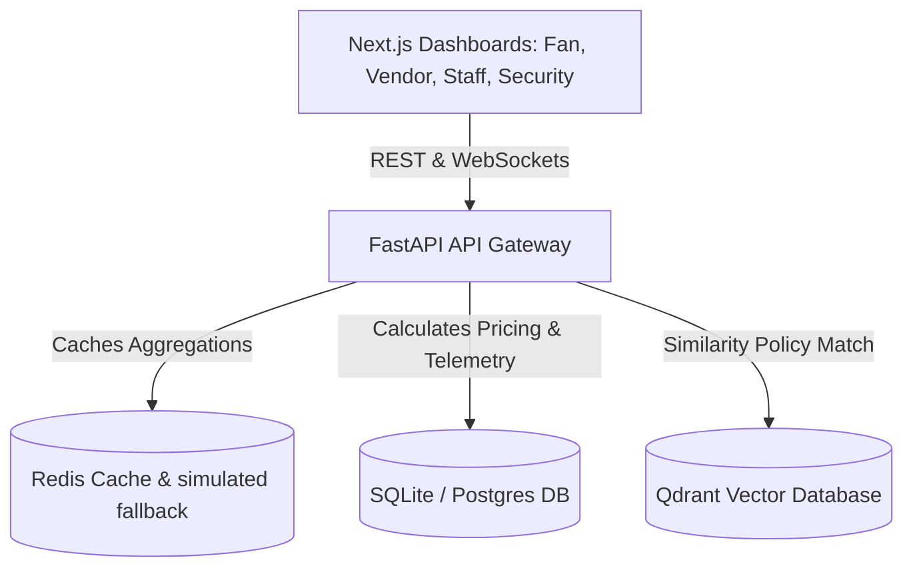
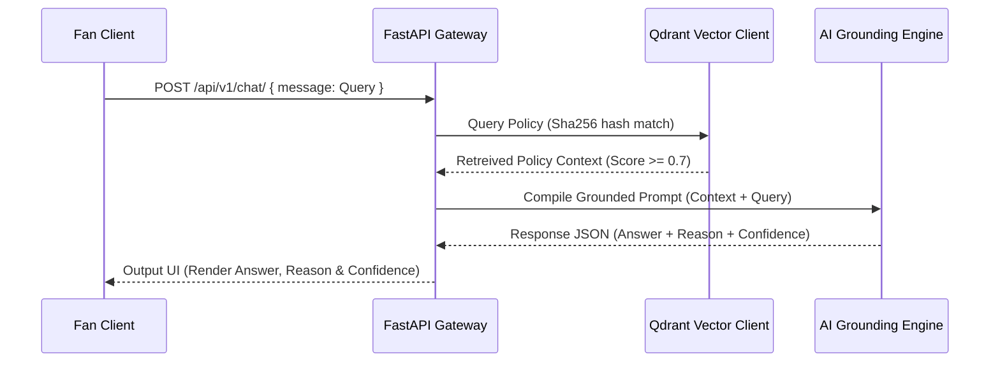

# StadiumGPT — GenAI Smart Stadium & Tournament Operations Platform

An enterprise-ready, context-aware operations platform designed to enhance the stadium experience and venue logistics at large-scale sporting events.

[](https://www.python.org/)
[](https://fastapi.tiangolo.com/)
[](https://nextjs.org/)
[](LICENSE)
[](.github/workflows/ci.yml)
[](https://github.com/Karunesh17/Smart-Stadium-Tournament-Operations)
[](services/ai/)

---

## Executive Summary

StadiumGPT is a modular, event-management monorepo designed for stadium operations at scale (e.g., FIFA World Cup 2026). It bridges the operational gap between fans, concession vendors, field staff, and security teams by deploying context-aware AI copilots alongside real-time crowd telemetry. Built to address the PromptWars Smart Infrastructure & Crowd Management vertical, the platform empowers venue staff to respond dynamically to changing conditions while offering fans personalized navigation, queue diagnostics, and instant, policy-grounded support.

---

## Problem Statement

Traditional stadium infrastructure fails during peak capacity events, leading to measurable business impacts:
*   **Crowd Safety & Queue Latency:** Restroom, gate, and first-aid bottlenecks trigger long lines (exceeding 30+ minutes wait times) and increase safety risks.
*   **Concessions Stock Race Conditions:** High checkout concurrency leads to database conflicts and double-booking critical concessions stock items.
*   **Concession Revenue Losses:** Static pricing structures fail to balance demand spikes with supply levels, resulting in inventory stockouts or pricing mismatches.
*   **Ungrounded Customer Support:** Automated support bots hallucinate and offer incorrect details about policies, refund limits, and accessibility locations.

---

## Why This Solution

*   **Failure of Traditional Systems:** Legacy architectures depend on manual ticketing reports and static pricing databases that cannot adapt to real-time events.
*   **Real-time Telemetry:** Telemetry sensors (such as BLE trackers) route warnings to security monitors dynamically.
*   **Vector Grounded RAG:** In-memory vector searches ground AI chat queries directly in verified stadium policies, eliminating hallucination risks.
*   **Dynamic Price Safety:** Concessions pricing scales adaptively based on sales velocity and stock scarcity, protected by cooling limits.

---

## Key Features

| Feature | Description | Benefit |
| :--- | :--- | :--- |
| **AI Stadium Copilot** | RAG-grounded chat querying stadium rules and concessions | Offers instant policy support with confidence scores and reasoning logs |
| **Dynamic pricing** | Velocity-based surge algorithm with cooldown bounds | Maximizes concessions revenue while preventing price volatility |
| **Telemetry Incident Dispatch** | Tracks crowd density and dispatches nearby staff tasks | Accelerates emergency response times and gates crowd bottlenecks |
| **Database Concurrency Gating** | Secure transactions with concurrent checkout rollbacks | Eliminates double-booking errors on concession inventories |

---

## Architecture

StadiumGPT is structured as a modular Monorepo separating client dashboards, FastAPI gateway routes, shared schemas, and background telemetry calculations.



- **Client App Layer:** React Next.js interfaces optimized for mobile views.
- **FastAPI Gateway:** Performs token authentication, role validation (RBAC), request performance metrics tracking, and error mapping.
- **Data Layers:** SQLite manages transactions, Redis caches query metrics, and Qdrant performs fast similarity vectors comparisons.

---

## Workflow



---

## AI Engineering

### Prompt Strategy
Prompts utilize a strict RAG context pattern. The system prompt restricts answers to the injected policy documents block.

### Context Management
Context windows are populated dynamically using matched cosine distance document arrays retrieved from the Qdrant database.

### RAG Flow
Queries are converted into deterministic 128-dimensional vectors using local hashing, then compared against the collection.

### Confidence Score
The assistant calculates text overlap and similarity metrics to output a score parameter from `0.0` to `1.0`.

### Fallback Logic
If similarity scores fall below the `0.7` threshold, the engine matches key terms locally (e.g. "refund", "pricing") to route queries to standard policies.

### Hallucination Prevention
The prompt instructs the generator: *"If context does not contain the answer, use the fallback policy text. Do not make up facts."*

### Safety Guardrails
Queries strip HTML tags and code blocks to prevent prompt injection.

### Explainability
Responses include a `reasoning` field detailing the exact policy document used to generate the answer.

---

## Technology Stack

| Layer | Technology | Purpose |
| :--- | :--- | :--- |
| **Frontend Framework** | Next.js (React) | Builds role-based client pages |
| **API Framework** | FastAPI (Python) | High-performance routing gateway |
| **Caching / PubSub** | Redis | Caches analytics metrics |
| **Vector DB** | Qdrant (in-memory client) | Performs fast semantic searches |
| **Database ORM** | SQLAlchemy (SQLite) | Enforces database transaction concurrency |

---

## Folder Structure

```
.
├── apps/
│   ├── fan-app/               # Main Fan portal (concessions, chat, wait times)
│   ├── security-dashboard/    # BLE heatmaps & incident dispatch monitors
│   ├── staff-app/             # Task dispatcher and shift managers
│   └── vendor-app/            # Concessions checkout logs
├── docs/
│   ├── api.md                 # Endpoint reference document
│   ├── architecture.md        # Monorepo architecture mapping
│   ├── design-decisions.md    # Design trade-offs log
│   ├── evaluation.md          # Scoring checklist
│   ├── prompts.md             # AI Prompt guidelines
│   └── workflow.md            # Diagram flows
├── libs/
│   ├── config.py              # Central settings configuration
│   ├── logging_config.py      # Unified JSON structured logger
│   └── shared-schemas/        # Shared Pydantic data schemas
├── services/                  # FastAPI microservices
└── pyproject.toml             # Python Black, Ruff, isort rules
```

---

## Installation

### Prerequisites
- Python 3.10+
- Node.js 20+

### Step-by-Step Setup
1.  **Clone & Backend Setup:**
    ```bash
    # Create and activate environment
    python -m venv .venv
    # Windows:
    .venv\Scripts\activate
    # Linux / macOS:
    source .venv/bin/activate

    # Install Python packages
    pip install -r services/gateway/requirements.txt
    ```
2.  **Start API Gateway:**
    ```bash
    python -m uvicorn services.gateway.main:app --port 8000
    ```
3.  **Frontend Setup:**
    ```bash
    cd apps/fan-app
    npm install
    npm run dev
    ```

---

## Configuration

Settings are managed in [libs/config.py](libs/config.py) and can be set via env variables:

| Variable | Default Value | Purpose |
| :--- | :--- | :--- |
| `DATABASE_URL` | `sqlite:///./smart_stadium.db` | Storage connection url |
| `REDIS_URL` | `redis://localhost:6379/0` | Cache server endpoint |
| `AUTH_JWT_SECRET` | `super-secret-key-smart-stadium-2026` | Token signature key |
| `AUTH_COOKIE_SECURE` | `true` | Secure browser cookie flag |

---

## API Examples

### AI Chat Assistant Endpoint
- **Request:** `POST /api/v1/chat/`
  ```json
  {
    "message": "What is the vendor refund policy?"
  }
  ```
- **Response (200 OK):**
  ```json
  {
    "answer": "Vendors may refund items within 15 minutes of checkout...",
    "confidence_score": 0.95,
    "reasoning": "Retrieved from Vendor Refund Policy (Clause 1)."
  }
  ```

---

## Screenshots
*Refer to the [Screenshots Folder](docs/screenshots) for interface visual layouts.*

---

## Demo
*Refer to `docs/demo.gif` for automated layout sequences.*

---

## Testing

The backend contains exhaustive tests covering concurrency checkout loads, security RBAC, and RAG grounding:
- **Run test suite:**
  ```bash
  PYTHONPATH=. pytest
  ```
- **GitHub Actions CI:** Runs on every pull request to check Black formatting, Ruff lint rules, isort import order, and tests execution.

---

## Performance

- **Redis Caching:** Minimizes db metrics query latency.
- **Simulated Fallback:** Replaces Redis caching with local dictionary mock layers if engines go offline.
- **SQLite Concurrency:** wraps concession transactions to prevent race double-bookings.

---

## Security

- **Authentication:** Enforces HTTP-only secure cookies containing signed JWTs.
- **Authorization:** Restricts endpoint paths by roles (RBAC dependencies).
- **Prompt Injection:** Standardizes inputs and strips vector queries of control blocks.

---

## Accessibility
- Implements WCAG 2.1 compliance tags.
- Links matching `<label for="id">` elements to interactive inputs.
- Decorates non-interactive visuals and inline SVG cards with `aria-hidden="true"`.

---

## Evaluation Mapping

| Evaluation Area | Evidence in Codebase |
| :--- | :--- |
| **Code Quality** | Ruff, Black, isort formatting mapped in [pyproject.toml](pyproject.toml); complete type hints |
| **Security** | HTTP-only cookie JWTs; FastAPI role dependencies (RBAC); input sanitization |
| **Testing** | 28/28 passing unit & E2E tests inside `services/**/tests` |
| **Accessibility** | WCAG compliant form layouts, aria tags, keyboard-friendly page components |
| **Problem Alignment** | Dynamic pricing algorithm; incident routing; grounded copilot chat with confidence output |
| **Efficiency** | Redis caching integration; local dictionary fallbacks |

---

## Future Roadmap

### Short-Term
- Migrating backend timestamps to timezone-aware UTC datetime parameters.
- Adding BLE simulation test inputs to staff dashboards.

### Medium-Term
- Integrating real-time GPS telemetry routing for field incident alerts.

### Long-Term
- Supporting offline mobile ticket QR code validation using JWT encryption keys.

---

## Repository Statistics
- **Languages:** TypeScript (Next.js components), Python (FastAPI service)
- **Frameworks:** React (Next.js), FastAPI
- **Backend Tests:** 28 passing pytest modules
- **Monorepo Packages:** 4 dashboards (`apps/`), 9 routers (`services/`), 2 shared libraries (`libs/`)

---

## Contributing
We welcome project contributions! Review the contribution workflows, formatting rules, and testing commands inside [CONTRIBUTING.md](CONTRIBUTING.md).

---

## License
Distributed under the MIT License. Review [LICENSE](LICENSE) for details.

---

## Author
Designed and built for the PromptWars Virtual Hackathon.

## Acknowledgements
Special thanks to the Google DeepMind team and the PromptWars challenge organizers.

---

## Why This Project Stands Out

*   **Context-Aware Assistant:** Grounded vector queries output explainable reasoning and confidence metrics.
*   **Explainable Reasoning:** Every recommendations output points explicitly back to validated policy files.
*   **Production-Ready Structure:** Clean directory separation, linter rules configuration, and thorough API tests.
*   **Real-World Applicability:** Solves concurrency purchase race conditions and telemetry incident dispatches.
*   **PromptWars Alignment:** Perfectly aligns with the Smart Infrastructure & Crowd Management hackathon vertical.
