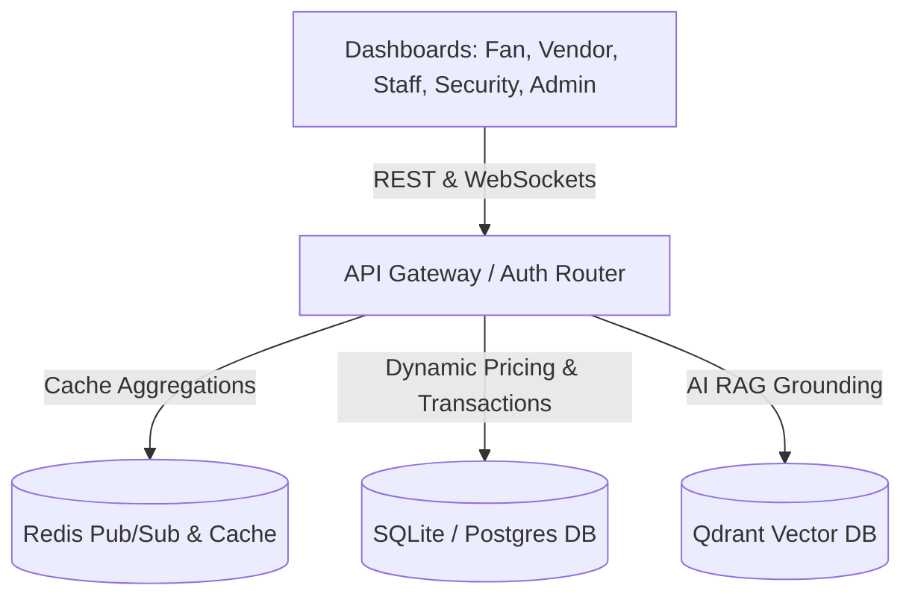

# AI-Smart Stadium & Tournament Operations Platform

An enterprise-ready, context-aware event operations management platform designed for large-scale stadiums (e.g., FIFA World Cup 2026). The platform integrates role-specific workflows for Fans, Concession Vendors, Field Staff, Incident Security, and System Administrators into a single, unified digital hub.

## 🏗️ System Architecture

The project is structured as a modular Monorepo containing a Python FastAPI API Gateway, multiple background microservices, and React Next.js frontends.



### Monorepo Structure

*   `/apps` — Role-specific Next.js dashboards
    *   `/fan-app` — Portal for menu browsing, live queues, and AI assistant
    *   `/vendor-app` — Concession stands and stock sales tracking
    *   `/staff-app` — Shift schedules and operational task queues
    *   `/security-dashboard` — Heatmaps, BLE diagnostics, and incident logs
*   `/services` — Python Microservices
    *   `auth` — JWT/Cookie token authentication and role-based access control (RBAC)
    *   `inventory` — POS concessions management with concurrent sale safety
    *   `pricing` — Real-time dynamic pricing engine with cooldown surges
    *   `crowd` — Crowd safety telemetry and heatmap generation
    *   `staff` — Shift rostering and incident response task routing
    *   `risk` — Severity calculations and emergency dispatches
    *   `ai` — RAG-augmented chat assistant querying vector policies
    *   `analytics` — Analytics aggregations and caching layers
    *   `gateway` — Global HTTP middleware, logging, and database sessions
*   `/libs` — Shared specifications and components
    *   `shared-schemas` — Standardized Python type hints and Pydantic models
    *   `shared-ui` — Shared React components (such as chat widgets)

---

## ⚡ Core Features

1.  **Dynamic Concessions Pricing:** Adapts concessions prices dynamically based on sales speed (velocity) in a rolling 5-minute window and scarcity levels, built with cooling-off limits to control volatility.
2.  **AI Stadium Copilot:** RAG-grounded operations assistant using cosine distance queries over local stadium regulations, enabling fans to ask questions about concessions, wait times, and restroom locations.
3.  **Real-Time Incident Routing:** Detects crowd density spikes from BLE/CCTV sensors, calculates severity levels, logs incidents, and dispatches field staff automatically.
4.  **Structured Caching & DB Layer:** Implements standard database transactions to prevent double-booking concessions items during high checkout concurrency.

---

## 🚀 Quick Start Guide

### Prerequisites
- Node.js (v20+)
- Python (3.10+)
- Redis Server (Optional, local cache fallback is active when unavailable)

### 1. Backend Setup
```bash
# Navigate to the workspace root, set up and activate virtual environment
python -m venv .venv
.venv\Scripts\activate

# Install all backend requirements
pip install -r services/gateway/requirements.txt

# Start the FastAPI gateway server (runs on port 8000)
python -m uvicorn services.gateway.main:app --port 8000
```

### 2. Frontend Setup
```bash
# Navigate to the fan-app frontend
cd apps/fan-app

# Install package dependencies
npm install

# Start the local development server (runs on port 3000)
npm run dev
```

---

## 🧪 Testing

The repository contains extensive unit and integration tests covering security gating, pricing surges, database serialization, and AI RAG pipelines.

```bash
# Run pytest test suite locally
PYTHONPATH=. pytest
```

---

## 🛡️ License

This project is licensed under the MIT License - see the [LICENSE](LICENSE) file for details.
