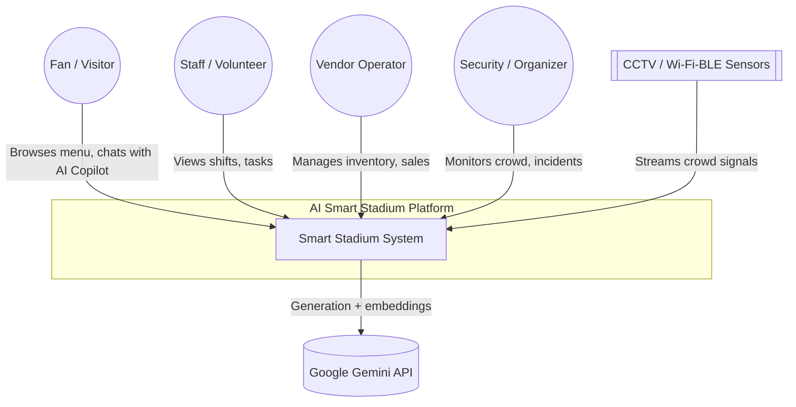
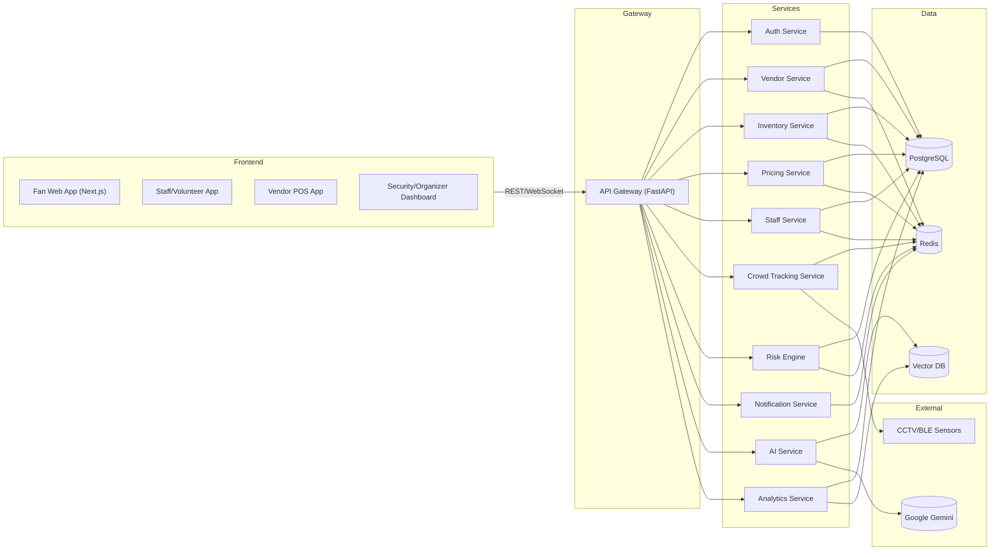
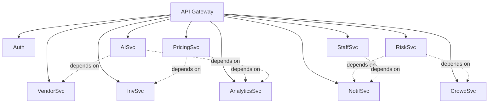
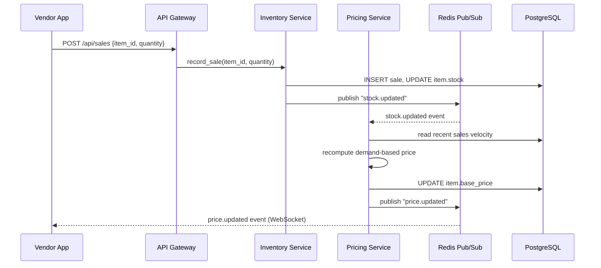
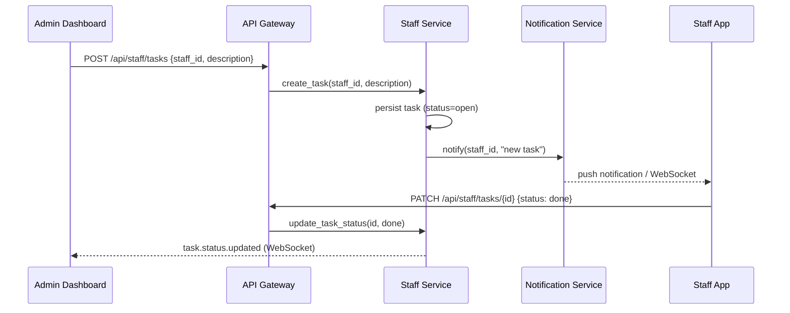
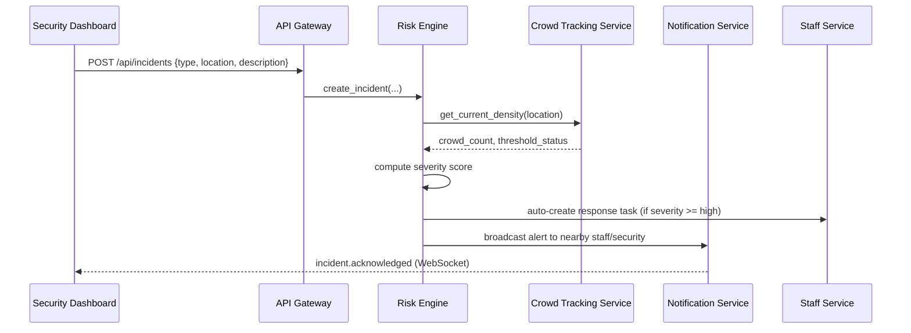
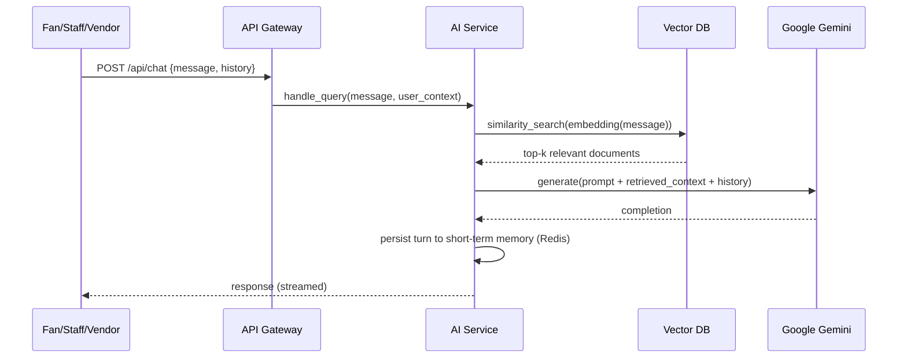
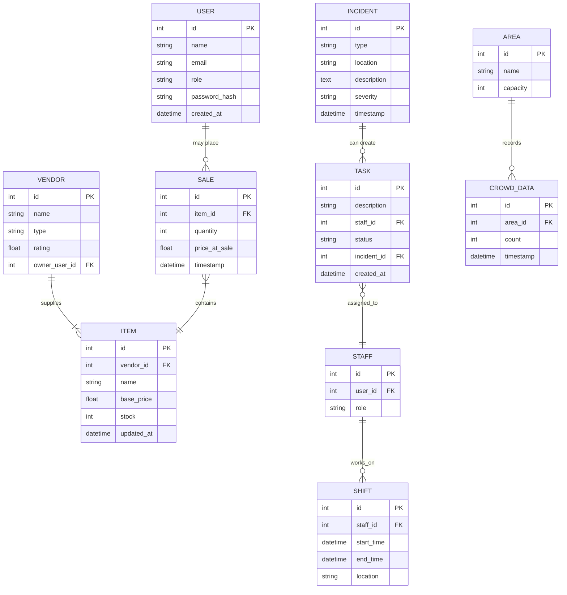

# Architecture — AI Smart Stadium Operations Platform

## Executive Summary

The AI Smart Stadium Operations Platform is a modular, service-oriented system that unifies five operational domains — Vendor Intelligence, People Tracking, Staff Management, Risk Management, and Dynamic Food Pricing — under a single AI-augmented backend. The platform is built on a FastAPI backend, Next.js frontends, PostgreSQL for relational state, Redis for caching and real-time pub/sub, a vector database for retrieval-augmented generation (RAG), and Google Gemini as the primary LLM. The system is designed for a fast MVP build (target: 14-day delivery cycle, per `phases.md`) while remaining structurally sound enough to scale into a multi-venue product.

This document is the architectural source of truth. `rules.md` enforces its conventions, `phases.md` sequences its delivery, `design.md` implements its UI surface, and `memory.md` distills it into durable context for future engineering sessions.

## High Level Architecture

The platform follows a modular monolith-leaning-microservices pattern: logically separated services (Auth, Vendor, Inventory, Pricing, Staff, Crowd Tracking, Risk, Notification, AI, Analytics) sit behind a single API Gateway layer implemented in FastAPI. Each service owns its own set of database tables (schema-level separation within one PostgreSQL instance for the MVP) and communicates with other services either synchronously via internal function calls (monolith deployment) or asynchronously via Redis pub/sub events (crowd alerts, price changes, incident notifications). This lets the team ship as one deployable unit initially, while keeping clean seams for extraction into true microservices post-MVP.

**Why this shape:** a stadium's operational modules are read-heavy and event-driven (crowd counts, sales, shift status) rather than transaction-heavy in the banking sense, so a shared Postgres instance with logical service boundaries avoids the operational overhead of distributed transactions while preserving the ability to peel off high-load services (Crowd Tracking, AI) later.

## Architecture Principles

1. **Modularity over premature distribution** — services are logically isolated (own models, own routers) but physically co-deployed until load demands otherwise.
2. **Event-driven where real-time matters** — crowd density, incident alerts, and price changes propagate via Redis pub/sub, not polling.
3. **RAG before fine-tuning** — all domain grounding (vendor SOPs, stadium policy, historical sales) is done through retrieval, not model fine-tuning, to keep iteration cheap.
4. **Privacy by aggregation** — people tracking never stores raw imagery or per-person identifiers; only aggregated, time-bucketed counts per area.
5. **Contract-first APIs** — every endpoint has a typed request/response schema (Pydantic) before implementation begins.
6. **Stateless services, stateful stores** — application services hold no session state in-process; all state lives in PostgreSQL, Redis, or the vector DB, so any service instance can be scaled horizontally.
7. **Fail loud, fail logged** — every service raises typed HTTP errors and emits structured logs; silent failures are treated as bugs.

## System Context Diagram

## Component Diagram

## Service Diagram

## Sequence Diagrams

### Vendor Flow (Sale → Stock Update → Price Recalculation)

### Staff Flow (Shift Assignment → Task Completion)

### Incident Flow (Report → Risk Assessment → Escalation)

### AI Copilot Flow (Query → RAG → Response)

## Microservices

| Service | Responsibility | Owns Tables | Depends On |
|---|---|---|---|
| **Authentication** | Login, registration, JWT issuance/refresh, role assignment | `users`, `roles` | — |
| **Vendor Service** | Vendor profile CRUD, ratings, vendor-facing analytics | `vendors` | Inventory, Analytics |
| **Inventory Service** | Item catalog, stock levels, sale recording | `items`, `sales` | Vendor Service |
| **Pricing Service** | Demand-based price computation, price history | reads `items`, `sales` | Inventory, Analytics |
| **Staff Service** | Shift scheduling, task assignment/tracking | `staff`, `shifts`, `tasks` | Notification |
| **Crowd Tracking** | Ingests sensor feeds, aggregates area counts, exposes heatmap | `crowd_data`, `areas` | — |
| **Risk Engine** | Incident intake, severity scoring, auto-escalation | `incidents` | Crowd Tracking, Notification, Staff |
| **Notification Service** | Redis pub/sub fan-out, WebSocket push, alerting | (stateless; uses Redis) | — |
| **AI Service** | RAG orchestration, chat/completions, embeddings | (stateless; uses Vector DB + Redis) | Vendor, Analytics, Vector DB, Gemini |
| **Analytics Service** | Cross-service reporting, dashboards, KPI aggregation | reads all domain tables | — |
| **Gateway** | Routing, auth middleware, rate limiting, request validation | — | all services |

### Authentication
Issues short-lived JWT access tokens (15 min) and longer-lived refresh tokens (7 days), stored httpOnly. Roles: `fan`, `staff`, `vendor`, `security`, `admin`. Role is embedded as a JWT claim and re-validated server-side on every protected route via FastAPI `Depends`.

### Vendor Service
Owns vendor identity and public profile (name, type, rating). Delegates stock and sales operations to Inventory Service to keep write paths narrow. Exposes read endpoints consumed by the AI Service for RAG grounding (vendor descriptions, categories).

### Inventory Service
Single writer for `items` and `sales`. Every sale write triggers a Redis `stock.updated` event so Pricing and Analytics stay current without polling.

### Pricing Service
Subscribes to `stock.updated`; recomputes price using a demand-velocity heuristic (sales in last N minutes relative to remaining stock and time-to-event-end). Publishes `price.updated` for real-time client updates. See API Architecture for endpoint contract.

### Staff Service
Owns scheduling (`shifts`) and work assignment (`tasks`). Task creation can originate from an admin, or automatically from the Risk Engine during incident escalation.

### Crowd Tracking
Consumes simulated/aggregated sensor input (CCTV counts, Wi-Fi/BLE probe counts) and writes rolling aggregate counts per `area`, never raw signal or device identifiers. Exposes heatmap and threshold-breach queries to Risk Engine and Security Dashboard.

### Risk Engine
Stateless scoring logic over incident type, location crowd density, and time-of-day. On severity ≥ "high", auto-creates a Staff Service task and triggers a Notification broadcast to the relevant zone's on-duty security/medical staff.

### Notification Service
Thin fan-out layer over Redis Pub/Sub → WebSocket. No business logic; purely transport. Every other service publishes domain events here.

### AI Service
Owns the RAG pipeline: embed query → vector search → prompt assembly → Gemini call → response. Maintains short-term conversational memory in Redis (keyed by session) and pulls long-term user preference context from PostgreSQL.

### Analytics Service
Read-only aggregator across all domain tables; powers dashboards in `design.md` (Vendor, Admin, Staff, Security, Analytics dashboards). No independent write path.

### Gateway
Single FastAPI ASGI app mounting all service routers under versioned prefixes (`/api/v1/...`). Owns cross-cutting concerns: JWT validation middleware, per-role rate limiting, request/response logging, and OpenAPI schema generation.

## Database Architecture

### ER Diagram

### Relationships
- `VENDOR.owner_user_id → USER.id` (one vendor owner per vendor account; a user may own multiple vendor profiles in future scope).
- `ITEM.vendor_id → VENDOR.id` (one-to-many).
- `SALE.item_id → ITEM.id` (many sales per item; stock decremented transactionally on insert).
- `STAFF.user_id → USER.id` (one-to-one; staff is a role-specific extension of user).
- `SHIFT.staff_id → STAFF.id`, `TASK.staff_id → STAFF.id` (one-to-many each).
- `TASK.incident_id → INCIDENT.id` (nullable; only populated for auto-escalated tasks).
- `CROWD_DATA.area_id → AREA.id` (time-series, one-to-many).

### Indexes
- `users(email)` — unique index, login lookups.
- `items(vendor_id)` — vendor inventory listing.
- `sales(item_id, timestamp)` — composite, for demand-velocity windowed queries.
- `shifts(staff_id, start_time)` — composite, for schedule lookups.
- `tasks(staff_id, status)` — composite, for "my open tasks" queries.
- `crowd_data(area_id, timestamp)` — composite, for heatmap time-window queries; consider a BRIN index given append-only time-series growth.
- `incidents(severity, timestamp)` — composite, for escalation dashboards.

### Constraints
- `users.email` — `UNIQUE NOT NULL`.
- `users.role` — `CHECK (role IN ('fan','staff','vendor','security','admin'))`.
- `items.stock` — `CHECK (stock >= 0)`.
- `sales.quantity` — `CHECK (quantity > 0)`; sale insert and stock decrement wrapped in a single DB transaction to prevent negative-stock races.
- `tasks.status` — `CHECK (status IN ('open','in-progress','done'))`.
- `incidents.severity` — `CHECK (severity IN ('low','medium','high','critical'))`.
- Foreign keys use `ON DELETE RESTRICT` for financial/audit tables (`sales`, `incidents`) and `ON DELETE CASCADE` for dependent operational tables (`shifts`, `tasks` on staff deletion).

## API Architecture

### REST
All endpoints versioned under `/api/v1/`. Standard resource verbs (GET/POST/PATCH/DELETE). Pagination via `?limit=&offset=`. Errors returned as `{ "detail": "message", "code": "ERROR_CODE" }` with correct HTTP status.

Core resources: `/auth`, `/vendors`, `/items`, `/sales`, `/pricing/forecast`, `/crowd`, `/staff/shifts`, `/staff/tasks`, `/incidents`, `/chat`, `/analytics`.

### WebSockets
A single multiplexed WebSocket channel per authenticated session at `/ws`, subscribing to Redis-backed topics scoped by role: `stock.updated`, `price.updated`, `crowd.alert`, `task.assigned`, `incident.created`. Clients subscribe only to topics relevant to their role (enforced server-side, not just client-side filtering).

### Streaming
AI Copilot responses stream token-by-token over the same WebSocket channel or via HTTP Server-Sent Events (SSE) fallback at `POST /api/v1/chat/stream`, to keep perceived latency low for Gemini generations.

## AI Architecture

### RAG
Retrieval-Augmented Generation grounds every AI Copilot response in stadium-specific fact rather than model prior knowledge. Pipeline: ingest source documents (vendor manuals, SOPs, historical sales summaries, stadium policy) → chunk → embed → store in vector DB → at query time, retrieve top-k chunks by cosine similarity → inject into prompt.

### Embeddings
Generated via Google's embedding model (text-embedding via Vertex AI/AI Studio), stored alongside chunk metadata (`source`, `section`, `updated_at`) in the vector DB for filtering and freshness checks.

### Memory
- **Short-term**: last N conversation turns per session, held in Redis with a TTL, injected into each prompt for continuity.
- **Long-term**: durable user preferences and frequently-asked patterns stored in PostgreSQL, retrieved and injected selectively (not the full history) to control prompt size.

### Vector Database
Qdrant (self-hosted or managed) as primary choice; FAISS acceptable as an in-process fallback for local development. Collections partitioned by document type (`vendor_docs`, `policy_docs`, `sales_summaries`) to allow targeted retrieval per query intent.

### Prompt Pipeline
1. Classify query intent (vendor question, staff SOP, pricing rationale, general chat).
2. Retrieve from the matching vector collection.
3. Assemble system prompt (role, constraints) + retrieved context + short-term memory + user message.
4. Send to Gemini; stream response back.
5. Log the full exchange (query, retrieved doc IDs, response) for later evaluation.

### Context Injection
Retrieved chunks are injected with explicit source labels (e.g., `[Vendor Manual: Vendor X]`) so the model can attribute claims and the UI can optionally surface "sources" to the user.

### Reasoning Flow
For multi-step queries (e.g., "why did this price change and should I restock"), the AI Service chains two calls: a retrieval+generation step for the factual answer, then a second Gemini call that reasons over the Pricing Service's raw signals (sales velocity, stock, time-to-event-end) to produce a recommendation, rather than asking the model to reason over unretrieved numbers from memory.

## Infrastructure

### Docker
Every service ships a Dockerfile; a root `docker-compose.yml` runs the FastAPI app, PostgreSQL, Redis, and Qdrant together for local development. Production uses individually built images pushed to a container registry.

### Deployment
- **Frontend**: Next.js apps deployed to Vercel (SSR/SSG, edge caching).
- **Backend**: FastAPI deployed to Render or Railway via Docker, behind a managed load balancer.
- **Database**: Managed PostgreSQL (Neon) with automated backups.
- **Cache**: Managed Redis (Redis Cloud/Upstash).
- **Vector DB**: Qdrant Cloud or self-hosted container alongside the backend.

### Scaling
Backend runs under `uvicorn` workers managed by `gunicorn`, horizontally scaled behind the platform's load balancer. Stateless service design (per Architecture Principles) means new instances require no session affinity. Crowd Tracking and AI Service are the two components expected to need independent scaling first, given sensor-ingestion and LLM-latency profiles respectively — this is the intended seam for future service extraction.

### Caching
Redis caches: (a) hot vendor/item reads to reduce DB load, (b) rate-limit counters, (c) short-term AI conversation memory, (d) pub/sub channels for real-time events. Cache invalidation is event-driven (writes publish invalidation alongside domain events) rather than time-based where correctness matters (stock, price).

### CDN
Static assets and Next.js build output served via Vercel's edge network. Vendor/menu images served through a CDN-backed object store (e.g., Cloudflare R2 or S3 + CloudFront) rather than through the API.

### Redis
Used simultaneously as: cache, pub/sub broker, and lightweight session/memory store. Redis Streams considered for the crowd-alert and incident-event log if replay/audit of real-time events becomes a requirement (Kafka intentionally deferred past MVP per `Technology Choices`).

## Security

### RBAC
Five roles (`fan`, `staff`, `vendor`, `security`, `admin`) enforced via FastAPI dependency injection at the route level — never via client-side checks alone. Each route declares its minimum required role(s) explicitly.

### JWT
Access tokens (15 min TTL) signed with a rotating secret (or asymmetric key for multi-service verification); refresh tokens (7 day TTL) stored httpOnly + `Secure` + `SameSite=Strict`. Refresh rotation invalidates the prior refresh token on use.

### Rate Limiting
Per-user, per-role rate limits enforced at the Gateway (e.g., token-bucket in Redis): stricter limits on write-heavy endpoints (`/sales`, `/incidents`) and AI endpoints (`/chat`) to control LLM cost exposure.

### Audit Logs
Every price change, incident report, and role-elevation action is written to an immutable `audit_log` table (actor, action, before/after state, timestamp), queryable by admins only.

### Encryption
TLS enforced end-to-end (frontend↔gateway, gateway↔services if physically separated later). Passwords hashed with bcrypt/argon2. No raw PII from crowd sensors is ever persisted (see Architecture Principles — privacy by aggregation).

## Tech Stack

| Layer | Option Chosen | Rationale | Alternative Considered |
|---|---|---|---|
| Backend Framework | FastAPI | Async-native, fast to build, auto OpenAPI docs, native WebSocket support | Django (too monolithic for a 14-day MVP) |
| Frontend | Next.js (React) + Tailwind CSS | SSR/SSG, large ecosystem, fast prototyping with shadcn/ui | Angular (steeper setup cost, less iteration speed) |
| Database | PostgreSQL | Structured relational integrity for transactions/schedules/logs; JSONB for flexible fields | MongoDB (adds query complexity for inherently relational data) |
| Cache/Realtime | Redis (Pub/Sub + Streams) | Simple, low-latency, doubles as cache and event bus | Kafka (operationally heavy for MVP scale) |
| Vector Store | Qdrant | LangChain-native integration, easy self-hosting or managed cloud | Pinecone (managed-only), FAISS (library-only, no service layer) |
| LLM Provider | Google Gemini (Vertex AI / AI Studio) | Stateful conversation and retrieval-friendly APIs | OpenAI (viable alternative, not the chosen default) |
| Deployment | Vercel + Render/Railway + Neon + Redis Cloud | Fastest path to a working deployed MVP with managed ops | Self-managed Kubernetes (unnecessary complexity at this stage) |

## Cross-References
- Delivery sequencing for every component above: see `phases.md`.
- Enforced coding, API, and RAG conventions: see `rules.md`.
- Dashboard and UI implementation of the roles/services above: see `design.md`.
- Product requirements this architecture satisfies: see `prd.md`.
- Durable summary for future AI sessions: see `memory.md`.
