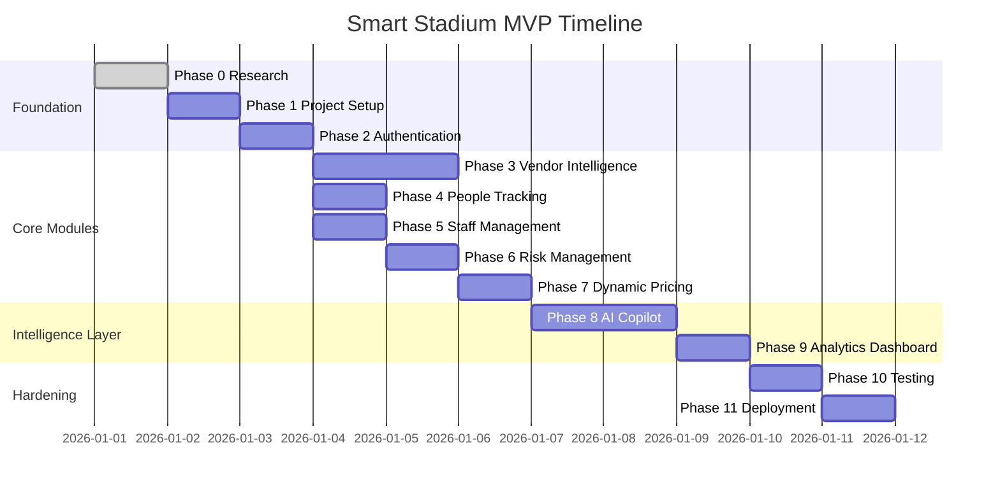

# Phases — AI Smart Stadium Operations Platform

## Project Timeline

Target: 14-day MVP build (per `architecture.md` deployment assumptions), structured as 12 phases (Phase 0–11). Estimated time is expressed in working days assuming a small team (2–4 engineers) working in parallel across frontend/backend.

---

## Phase 0 — Research

**Objectives:** Confirm scope, finalize tech stack, validate module boundaries against `architecture.md`.
**Deliverables:** `research.md` (source of truth), stack decision table, module list confirmation.
**Acceptance Criteria:** All six planned documentation files (`architecture.md`, `phases.md`, `prd.md`, `rules.md`, `design.md`, `memory.md`) have a consistent, non-contradictory source to draw from.
**Dependencies:** None.
**Estimated Time:** 1 day.
**GitHub Milestone:** `v0.1-research`.
**Sprint Tasks:** Compile research doc; circulate for team review; freeze scope.
**Priority:** Critical.
**Risk:** Scope creep if research isn't frozen before Phase 1 begins — mitigate by treating `research.md` as immutable once Phase 1 starts.

## Phase 1 — Project Setup

**Objectives:** Stand up the monorepo, CI skeleton, and local dev environment.
**Deliverables:** Repo structure (per `rules.md` Folder Structure), `docker-compose.yml` (FastAPI + Postgres + Redis + Qdrant), base Next.js app, base FastAPI app with health-check route, CI pipeline (lint + test on PR).
**Acceptance Criteria:** `docker-compose up` boots all services locally; CI passes on an empty PR; `/health` returns 200.
**Dependencies:** Phase 0.
**Estimated Time:** 1 day.
**GitHub Milestone:** `v0.2-scaffolding`.
**Sprint Tasks:** Initialize repo; configure Docker; configure ESLint/Prettier/Black/Ruff; wire GitHub Actions.
**Priority:** Critical.
**Risk:** Environment drift between local and deployed Docker images — mitigate by using the same Dockerfile for local and prod.

## Phase 2 — Authentication

**Objectives:** Implement user registration/login, JWT issuance, and RBAC middleware.
**Deliverables:** `USER`/`ROLE` tables and migrations, `/api/v1/auth/register`, `/api/v1/auth/login`, `/api/v1/auth/refresh`, FastAPI role-dependency decorators, login UI in Next.js.
**Acceptance Criteria:** All five roles (fan, staff, vendor, security, admin) can register and log in; protected routes reject invalid/expired tokens with 401; role-gated routes reject wrong roles with 403.
**Dependencies:** Phase 1.
**Estimated Time:** 1 day.
**GitHub Milestone:** `v0.3-auth`.
**Sprint Tasks:** Schema + migration; password hashing (argon2); JWT issue/verify/refresh; frontend auth context and protected-route wrapper.
**Priority:** Critical — every later phase depends on this.
**Risk:** Refresh-token rotation bugs causing silent logouts — mitigate with integration tests covering token expiry and rotation.

## Phase 3 — Vendor Intelligence

**Objectives:** Build vendor profile management and the inventory/sales pipeline.
**Deliverables:** `VENDOR`, `ITEM`, `SALE` tables; `/api/v1/vendors`, `/api/v1/items`, `/api/v1/sales` endpoints; Vendor POS App (item list, stock editor, sale-recording form).
**Acceptance Criteria:** A vendor can create items, record a sale, and see stock decrement atomically (no negative stock under concurrent sales, verified by a load test).
**Dependencies:** Phase 2.
**Estimated Time:** 2 days.
**GitHub Milestone:** `v0.4-vendor`.
**Sprint Tasks:** Schema + migrations + indexes; sale-transaction endpoint with row-level locking; Vendor POS UI; Redis `stock.updated` publish on sale.
**Priority:** High.
**Risk:** Race conditions on concurrent stock decrement — mitigate with `SELECT ... FOR UPDATE` or an atomic `UPDATE ... WHERE stock >= quantity` pattern.

## Phase 4 — People Tracking

**Objectives:** Ingest simulated crowd sensor data and expose aggregated density per area.
**Deliverables:** `AREA`, `CROWD_DATA` tables; sensor simulator (CCTV/Wi-Fi-BLE stand-in generating aggregate counts); `/api/v1/crowd` heatmap endpoint; heatmap widget on Security Dashboard.
**Acceptance Criteria:** Heatmap updates within 5 seconds of a simulated count change; no per-device or per-person identifiers are ever written to the database (privacy audit passes).
**Dependencies:** Phase 2.
**Estimated Time:** 1 day.
**GitHub Milestone:** `v0.5-crowd`.
**Sprint Tasks:** Schema + migration; simulator script; aggregation endpoint; heatmap component.
**Priority:** High.
**Risk:** Simulator producing unrealistic distributions that mask real threshold-breach bugs — mitigate by parameterizing the simulator with configurable spike scenarios for testing.

## Phase 5 — Staff Management

**Objectives:** Shift scheduling and task assignment/tracking.
**Deliverables:** `STAFF`, `SHIFT`, `TASK` tables; `/api/v1/staff/shifts`, `/api/v1/staff/tasks`; Staff/Volunteer App (my shifts, my tasks, mark-done action); Admin shift-builder UI.
**Acceptance Criteria:** Admin can assign a shift and task; assigned staff sees it in real time via WebSocket push; task status transitions are constrained to `open → in-progress → done`.
**Dependencies:** Phase 2.
**Estimated Time:** 1 day.
**GitHub Milestone:** `v0.6-staff`.
**Sprint Tasks:** Schema + migrations; CRUD endpoints; Notification Service wiring; Staff App views.
**Priority:** High.
**Risk:** Notification delivery gaps if a staff member's client is offline — mitigate with a persisted "unread tasks" query as a WebSocket fallback.

## Phase 6 — Risk Management

**Objectives:** Incident intake, severity scoring, and auto-escalation to Staff Service.
**Deliverables:** `INCIDENT` table; `/api/v1/incidents`; Risk Engine severity-scoring function (incident type × crowd density × time-of-day); auto-task creation on high/critical severity; Security Dashboard incident feed.
**Acceptance Criteria:** A "medical" incident reported in a high-density area is scored "high" or above and automatically creates a staff task within 2 seconds; incident feed updates in real time.
**Dependencies:** Phase 4 (needs crowd density), Phase 5 (needs task creation).
**Estimated Time:** 1 day.
**GitHub Milestone:** `v0.7-risk`.
**Sprint Tasks:** Schema + migration; severity-scoring logic; auto-escalation integration; incident feed UI.
**Priority:** High.
**Risk:** Severity scoring producing false negatives on critical incidents — mitigate with a manual override control on the Security Dashboard regardless of computed score.

## Phase 7 — Dynamic Pricing

**Objectives:** Demand-based price recalculation subscribed to inventory events.
**Deliverables:** Pricing Service; `/api/v1/pricing/forecast`; price-history tracking; real-time price-update push to Vendor and Fan apps.
**Acceptance Criteria:** A price recalculation is triggered within 5 seconds of a qualifying sale event; forecast endpoint returns a demand-based projection with a stated confidence basis.
**Dependencies:** Phase 3 (needs sales data).
**Estimated Time:** 1 day.
**GitHub Milestone:** `v0.8-pricing`.
**Sprint Tasks:** Demand-velocity heuristic implementation; Redis subscriber; price-history table; UI price-change indicator.
**Priority:** Medium-High.
**Risk:** Price oscillation (rapid up/down flapping) under noisy sales data — mitigate with a minimum re-price interval (cooldown) per item.

## Phase 8 — AI Copilot

**Objectives:** Implement the full RAG pipeline and chat interface across roles.
**Deliverables:** Vector DB collections populated from vendor/policy/sales-summary documents; `/api/v1/chat` and `/api/v1/chat/stream`; AI Service (retrieval → prompt assembly → Gemini call); chat widget embedded in all four frontends.
**Acceptance Criteria:** A vendor question about their own inventory returns a grounded, source-attributable answer; responses stream token-by-token; conversation memory persists within a session.
**Dependencies:** Phase 3, Phase 7 (pricing rationale queries need pricing data).
**Estimated Time:** 2 days.
**GitHub Milestone:** `v0.9-ai-copilot`.
**Sprint Tasks:** Document ingestion + embedding pipeline; vector collection setup; prompt-assembly module; Gemini integration; streaming endpoint; chat UI.
**Priority:** High (core differentiator).
**Risk:** Latency from chained retrieval + generation calls degrading perceived responsiveness — mitigate with streaming responses and a "thinking" state in the UI.

## Phase 9 — Analytics Dashboard

**Objectives:** Cross-service reporting and KPI visualization for admins.
**Deliverables:** Analytics Service read endpoints; Analytics Dashboard (sales trends, crowd trends, staff utilization, incident frequency).
**Acceptance Criteria:** Dashboard loads aggregate data for a full event day in under 2 seconds; all charts reconcile against raw table counts in a spot-check.
**Dependencies:** Phases 3–7 (needs data from all modules).
**Estimated Time:** 1 day.
**GitHub Milestone:** `v0.10-analytics`.
**Sprint Tasks:** Aggregation queries; caching layer for expensive rollups; dashboard charts (per `design.md` chart components).
**Priority:** Medium.
**Risk:** Expensive cross-table aggregation queries impacting primary DB performance — mitigate with read replicas or materialized views if load testing shows contention.

## Phase 10 — Testing

**Objectives:** End-to-end validation across all modules.
**Deliverables:** Unit tests per service (per `rules.md` Testing conventions), integration tests for cross-service flows (sale→price, incident→task), load test for concurrent sales and crowd ingestion.
**Acceptance Criteria:** ≥80% coverage on business-logic modules; all four sequence-diagram flows in `architecture.md` pass end-to-end integration tests; load test shows no negative-stock or duplicate-task defects under concurrency.
**Dependencies:** Phases 2–9.
**Estimated Time:** 1 day.
**GitHub Milestone:** `v0.11-testing`.
**Sprint Tasks:** Write/expand unit tests; write integration test suite; run load tests; triage and fix defects.
**Priority:** Critical.
**Risk:** Time pressure causing test coverage to be cut — mitigate by prioritizing the concurrency-sensitive paths (sales, pricing, task escalation) over full-coverage vanity metrics.

## Phase 11 — Deployment

**Objectives:** Ship the MVP to production infrastructure.
**Deliverables:** Deployed Next.js apps on Vercel, FastAPI on Render/Railway, managed Postgres (Neon), managed Redis, Qdrant instance; monitoring dashboards (Prometheus/Grafana or platform-native equivalents); rollback plan.
**Acceptance Criteria:** All four frontends reachable over HTTPS; all sequence-diagram flows verified against production endpoints; monitoring shows green health checks for 24 hours post-launch.
**Dependencies:** Phase 10.
**Estimated Time:** 1 day.
**GitHub Milestone:** `v1.0-launch`.
**Sprint Tasks:** Provision infra; configure environment secrets; run smoke tests in production; document rollback procedure.
**Priority:** Critical.
**Risk:** Configuration drift between staging and production causing last-minute surprises — mitigate by deploying to a staging environment identical to production at least once before Phase 11 begins.

---

## Cross-References
- Component/service definitions referenced above: see `architecture.md`.
- Coding, branching, and Definition of Done conventions applied throughout: see `rules.md`.
- UI deliverables per phase: see `design.md`.
- Feature scope and acceptance criteria trace back to: see `prd.md`.
